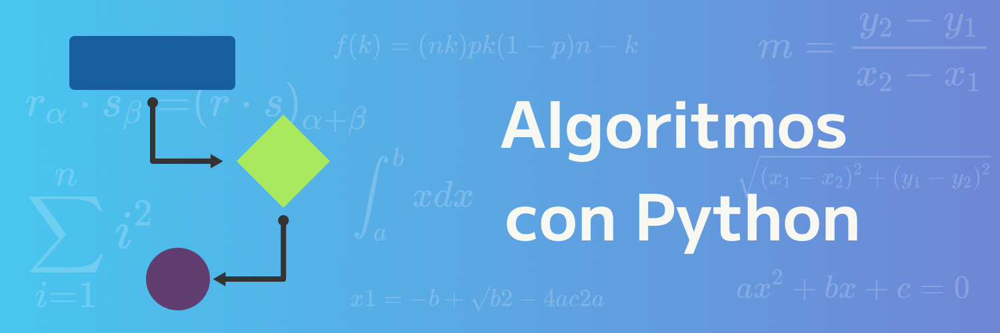
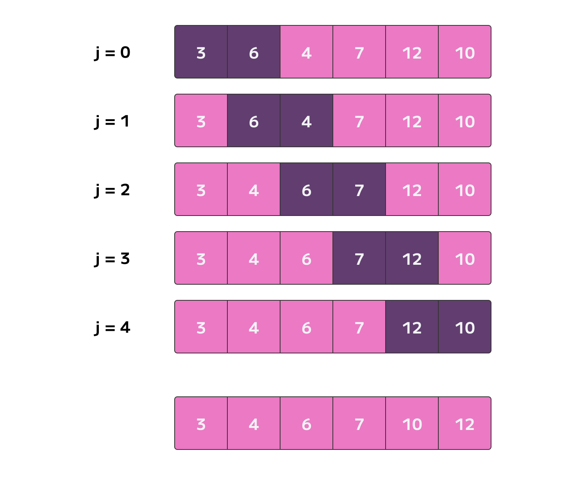

# Algoritmos con Python

Contenido:

1. Bubble Sort
2. Quick Sort

## Bubble Sort

Es el primer algoritmo de ordenamiento que estaremos viendo, ya que este nos da inicio a la forma en que se mejoraron los demás.

Lo que hace es que recorre todo el arreglo evaluando si el elemento de lado izquierdo es mayor al elemento del lado derecho y así hasta llegar a los 2 últimos elementos.

Selcciona el termino del lado izquierdo y compara si es mayor al termino del lado derecho. Si si cumple la condición, lo que hace es intercambiar lugares colocando a la derecha el elemento más grande.

Al ir moviendo el elemento más grande a la derecha, esto hará que al final quede el elemento más grande de todo el arreglo, ahora tiene que volver a hacerse otro recorrido donde vuelva a evaluar 2 elementos para poder llevarse el segundo elemento menos grande hasta final.

Como notarás, este arreglo se repite muchas veces hasta que al final ya tenemos el arreglo ordenado de menor a mayor.

Esto quiere decir en términos de programación que harás un ciclo que pase por todos los elementos y luego otro ciclo que será el que evalúe el elemento de la izquierda y derecha y este pase por todos los elementos donde **no** está el mayor al final.

